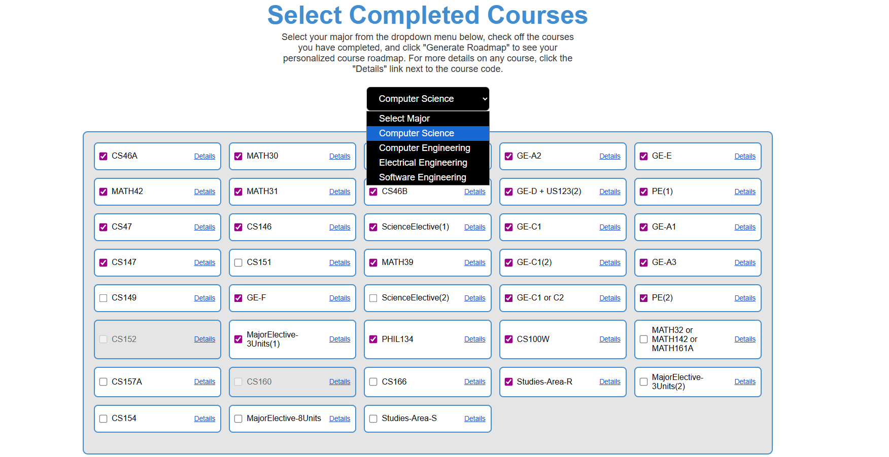
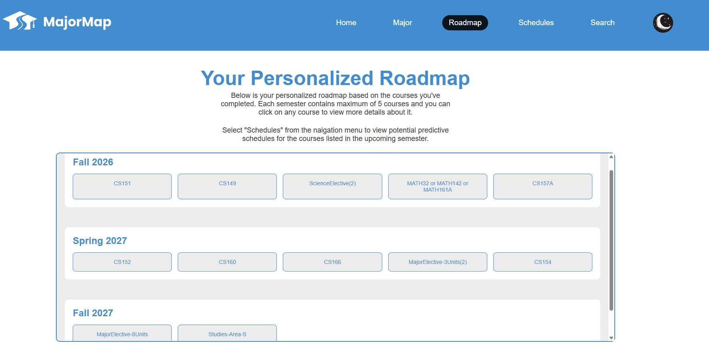

# Major Map

> Website that generated roadmap and schedules for SJSU students

## Team

| Name | GitHub | Email |
|------|--------|-------|
| Bryan Lin | [@7HE-LUCKY-FISH](https://github.com/7HE-LUCKY-FISH) | bryan.lin@sjsu.edu |
| Anthony Nguyen | [@antmtn](https://github.com/antmtn) | anthony.nguyen05@sjsu.edu |
| Hoang Nguyen | [@Daoranger](https://github.com/Daoranger) | hoang.k.nguyen@sjsu.edu |
| Pawandeep Singh | [@PawanS115](https://github.com/PawanS115) | pawandeep.singh@sjsu.edu |

**Advisor:** [Bhawandeep Singh Harsh]

---

## Problem Statement

Enrolling in classes or planning future semesters at university can be complex for
students, requiring time and research to choose classes and research professors. When carefully
building their schedules, students may look over their major’s roadmap, required courses,
third-party websites for professor reviews, and more to get the information they need. The
process of creating a long-term academic plan and a semester class schedule is an important step
for students to be on track and graduate on time.

## Solution

The MajorMap is designed to address the problem of information fragmentation by
consolidating relevant information and services into a single platform that helps SJSU students
plan their schedules for future semesters. The application will generate a personalized roadmap
for each student, taking into account their major requirements and completed coursework.
Furthermore, the schedule planner will use historical data to predict professors and timings for
future section offerings, and integrate professor ratings into the scheduling interface for quick
reference.

### Key Features

- Generating a roadmap specific to user's major and completed courses
- Utilizing a machine learning model to generate predictive schedules for the upcoming semesters
- Ability to search through historical course schedule data

---

## Demo

[Link to demo video or GIF]

**Live Demo:** [URL if deployed]

---

## Screenshots

| Feature | Screenshot |
|---------|------------|
| [Feature 1] |  |
| [Feature 2] |  |

---

## Tech Stack

| Category | Technology |
|----------|------------|
| Frontend | React + Vite |
| Backend | |
| Database | Redis |
| Deployment | |

---

## Getting Started

### Prerequisites

- [Prerequisite 1] v.X.X+
- [Prerequisite 2] v.X.X+

### Installation

```bash
# Clone the repository
git clone https://github.com/7HE-LUCKY-FISH/major_map
cd major_map

# Install dependencies
npm install

# Set up environment variables
cp .env.example .env
# Edit .env with your values

# Run database migrations (if applicable)
[migration command]
```

### Running Locally

```bash
# Development mode
npm run dev

# The app will be available at http://localhost:XXXX
```

### Running Tests

```bash
[test command]
```

---

## API Reference

<details>
<summary>Click to expand API endpoints</summary>

| Method | Endpoint | Description |
|--------|----------|-------------|
| GET | `/api/resource` | Get all resources |
| GET | `/api/resource/:id` | Get resource by ID |
| POST | `/api/resource` | Create new resource |
| PUT | `/api/resource/:id` | Update resource |
| DELETE | `/api/resource/:id` | Delete resource |

</details>

---

## Project Structure

```
.
├── [folder]/           # Description
├── src/                # Source code files
├── tests/              # Test files
├── docs/               # Documentation files
└── README.md
```

---

## Contributing

1. Create a feature branch (`git checkout -b feature/amazing-feature`)
2. Commit your changes (`git commit -m 'Add amazing feature'`)
3. Push to the branch (`git push origin feature/amazing-feature`)
4. Open a Pull Request

### Branch Naming

- `feature/` - New features
- `fix/` - Bug fixes
- `docs/` - Documentation updates
- `refactor/` - Code refactoring

### Commit Messages

Use clear, descriptive commit messages:
- `Add user authentication endpoint`
- `Fix database connection timeout issue`
- `Update README with setup instructions`

---

## Acknowledgments

- [Resource/Library/Person]
- [Resource/Library/Person]

---

## License

This project is licensed under the <FILL IN> License - see the [LICENSE](LICENSE) file for details.

---

*CMPE 195A/B - Senior Design Project | San Jose State University | Spring 2026*
