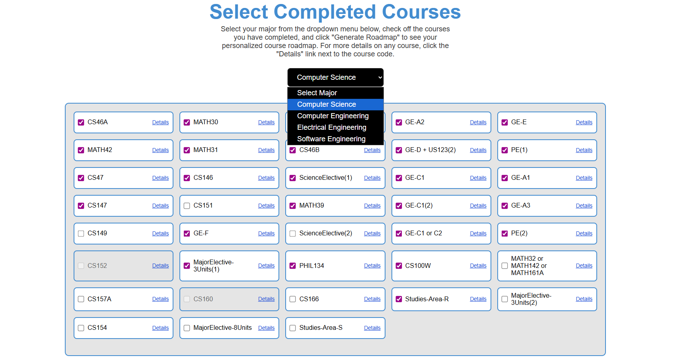
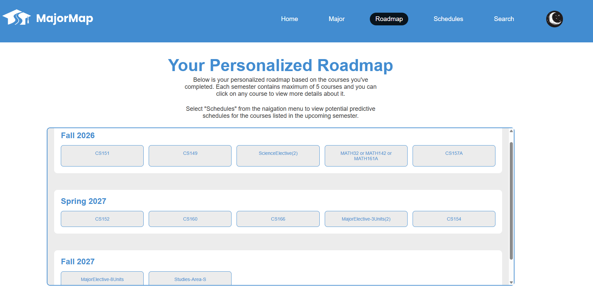
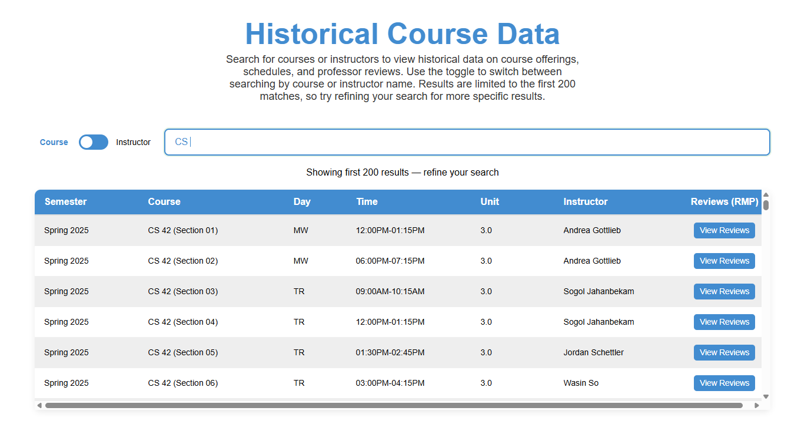
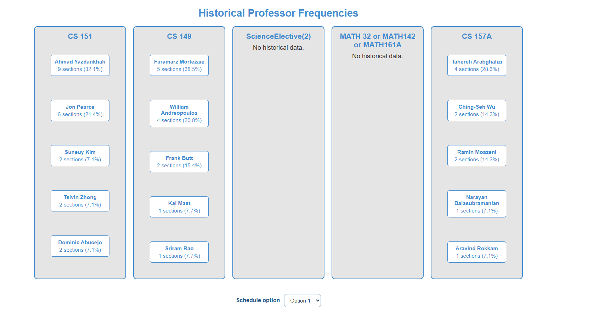

# Major Map - User Guide

Welcome to Major Map! This guide will help you navigate the platform to plan your academic journey, explore course roadmaps, and generate optimized schedules.

## Table of Contents
1. [Selecting Your Major](#1-selecting-your-major-the-major-tab)
2. [Exploring Your Roadmap](#2-exploring-your-roadmap-the-roadmap-tab)
3. [Finding Course Details & Ratings](#3-finding-course-details--ratings-the-search-tab)
4. [Generating Your Schedule](#4-generating-your-schedule-the-schedules-tab)

---

### 1. Selecting Your Major (The Major Tab)
To get started, navigate to the **Major** tab. 
* Select your specific degree program. 
* This step is crucial, as it tells the application which graduation requirements, prerequisite chains, and historical course data need to be loaded to customize your experience.

### 2. Exploring Your Roadmap (The Roadmap Tab)
The **Roadmap** tab provides a visual timeline of your degree.
* **View Requirements:** See a breakdown of core classes, electives, and prerequisites required for your selected major.
* **Plan Ahead:** Use this page to visualize what you need to complete and what classes are coming up next in your academic career.

### 3. Finding Course Details & Ratings (The Search Tab)
Use the **Search** tab to look up specific classes and instructors.
* **Class Descriptions:** You can search for any course to view its specific details, prerequisites, and historical availability. 
* **Professor Ratings:** When viewing course and instructor options, you will find direct links to Rate My Professor (RMP) profiles. This allows you to quickly check professor ratings and reviews to help you choose the best instructors for your learning style.

### 4. Generating Your Schedule (The Schedules Tab)
This is the core predictive feature of Major Map. Head over to the **Schedules** tab to build your upcoming semester.
* **Select Courses:** Input the specific courses you wish to take in the upcoming term.
* **Generate:** The platform uses predictive modeling based on historical data to forecast instructor availability and class feasibility.
* **Review Options:** Browse through the generated schedule variations to find the one that best fits your time preferences. 

---
*For further technical support or issues, please reach out to the site administrator.*
