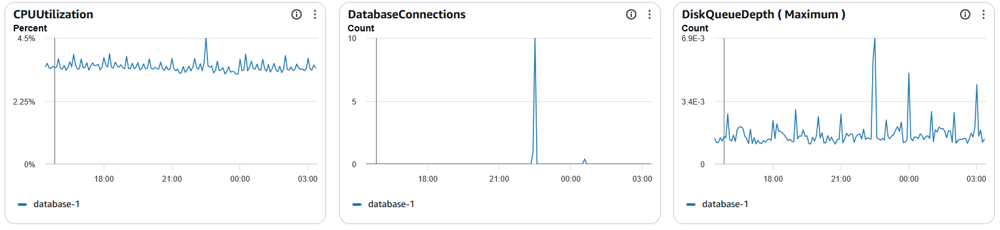

## Stress Test Results (Database)

This section summarizes database performance testing conducted using Sysbench against an AWS RDS MySQL instance connected to a FastAPI backend.

---

### Test Configurations

Two levels of concurrency were tested to evaluate system scalability.

#### Light Load Test (5 Threads)

| Parameter | Value |
|----------|------|
| Threads | 5 |
| Duration | ~20 seconds |
| Workload | OLTP read/write |
| Total Queries | ~2,320 |

#### Stress Load Test (50 Threads)

| Parameter | Value |
|----------|------|
| Threads | 50 |
| Duration | ~30 seconds |
| Workload | OLTP read/write |
| Total Queries | ~29,728 |

---

### 5-Thread Results

| Metric | Value |
|------|------|
| Transactions/sec (TPS) | 7.09 TPS |
| Queries/sec (QPS) | 113.47 QPS |
| Average Latency | 695.55 ms |
| Errors | 0 |
| Reconnects | 0 |

#### Observations
- System executed all requests successfully with no failures.
- Throughput remained stable but relatively low.
- High latency (~695 ms) suggests network or database overhead.
- System was not saturated at this load level.

---

### 50-Thread Results

| Metric | Value |
|------|------|
| Transactions/sec (TPS) | 60.44 TPS |
| Queries/sec (QPS) | 966.97 QPS |
| Average Latency | 817.93 ms |
| Minimum Latency | 671.13 ms |
| Maximum Latency | 1164.95 ms |
| Errors | 0 |
| Reconnects | 0 |

#### Observations
- System scaled successfully from 5 → 50 threads.
- Throughput increased significantly (~8× improvement).
- No errors or connection failures under heavy load.
- Latency increased slightly under stress conditions.
- System remained stable throughout execution.
- Shown in the cloudwatch logs below we were able to view the conditions.
- The server performance did not degrade while we were connecting to the database. 
---

The system demonstrates strong stability and reliable performance under both light and heavy load conditions. While throughput scales effectively with concurrency, latency remains elevated due to network overhead and database instance constraints. Overall, the system is suitable for moderate production workloads with clear opportunities for optimization.
